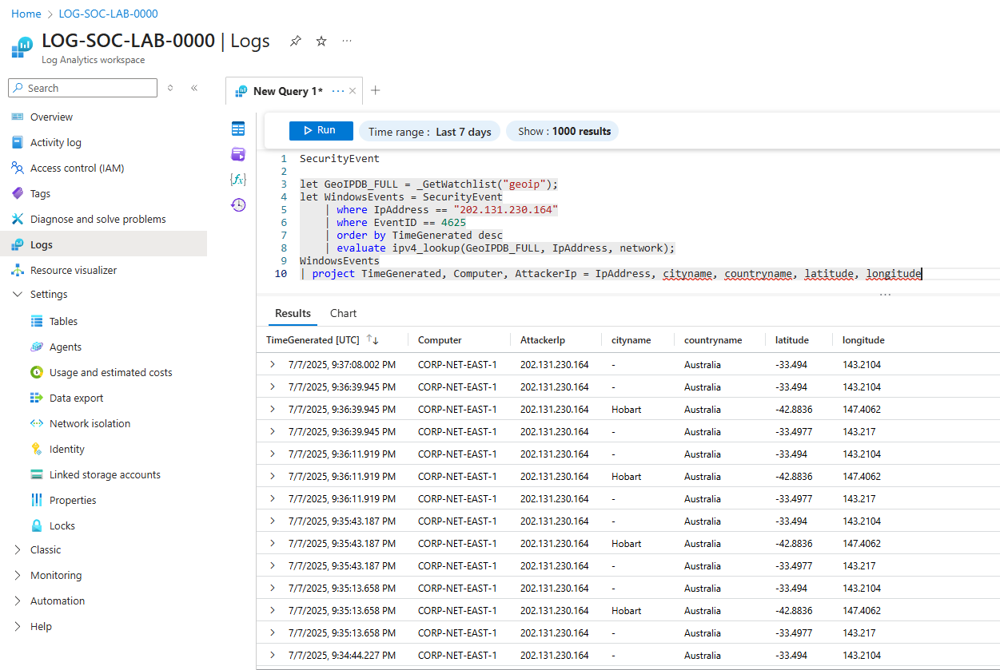

# 🛡️ Home SOC Lab in Azure (Cloud-Based Honeypot with Microsoft Sentinel)

## 📘 Overview
This project is a fully cloud-based Security Operations Center (SOC) simulation built using a free-tier Microsoft Azure account. It is designed to showcase real-world attack data against a publicly exposed Windows VM using modern cloud-native tools like Microsoft Sentinel.

---

## ✨ Key Features
- **Honeypot VM**: Windows 10 VM exposed to the internet, attracting real-world attacks.
- **Log Analytics Workspace**: Central repository for Windows security logs.
- **Microsoft Sentinel (SIEM)**: Configured to collect, query, and visualize attack data.
- **KQL Queries**: Used for filtering logs and enriching with IP geolocation data.
- **Attack Map Dashboard**: Visualizes attacker locations on a world map using workbook + watchlist integration.

---

## ⚙️ Technologies Used
- Microsoft Azure [VM, VNet, Network Security Group (NSG)]
- Windows 10 Virtual Machine
- Azure Log Analytics
- Microsoft Sentinel (SIEM)
- Kusto Query Language (KQL)
- IP Geolocation Enrichment (Custom Watchlist)
- Remote Desktop Protocol (RDP)

---

## 🧱 Architecture Overview

The lab is structured as follows:

- A Windows 10 honeypot VM is deployed on Azure and exposed to the internet.
- Logs from the VM are forwarded to an Azure Log Analytics Workspace.
- Microsoft Sentinel is used to monitor, query, and visualize logs.
- IP geolocation enrichment is performed via a custom watchlist.
- Attacker origins are plotted on a live map dashboard in Sentinel.

---

## 🧰 Lab Setup Summary

1. ✅ Created free Azure subscription and resource group  
2. ✅ Deployed Windows 10 VM with public IP and open firewall (NSG + local)  
3. ✅ Configured Log Analytics workspace and connected Microsoft Sentinel  
4. ✅ Installed Azure Monitoring Agent on VM  
5. ✅ Uploaded geolocation watchlist (CSV) to Sentinel  
6. ✅ Built and ran KQL queries to correlate IPs with locations  
7. ✅ Deployed an interactive attack map workbook

---

## 🧠 Example KQL Queries

### Failed Login Attempts
```kql
SecurityEvent
| where EventID == 4625
| project TimeGenerated, Account, Computer, IPAddress
```

### Enriched with Geolocation
```kql
SecurityEvent
| where EventID == 4625
| join kind=leftouter (
    _GetWatchlist('goip') 
    | project Network, Latitude, Longitude, CityName, CountryName
) on $left.IPAddress contains $right.Network
| project TimeGenerated, Account, IPAddress, CityName, CountryName
```

## 📸 Screenshot - GeoIP KQL Query
  
*This query extracts Event ID 4625 (failed logins), enriches with GeoIP data using a custom watchlist, and outputs attacker locations with latitude and longitude.*
